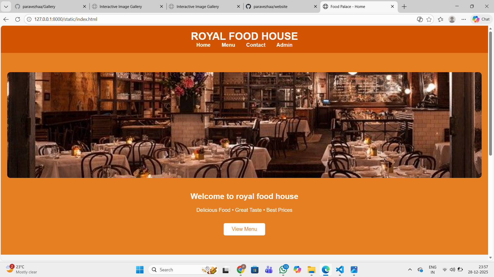
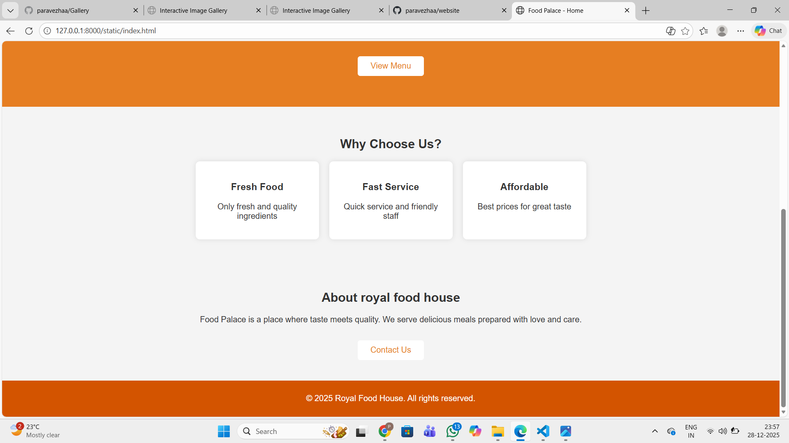
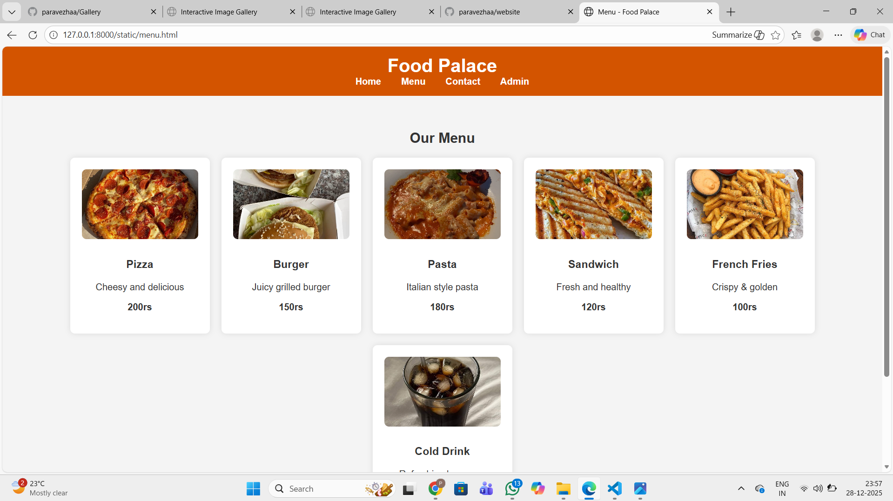
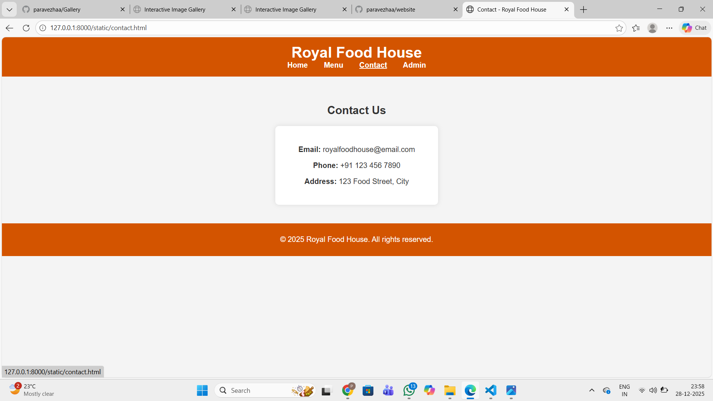
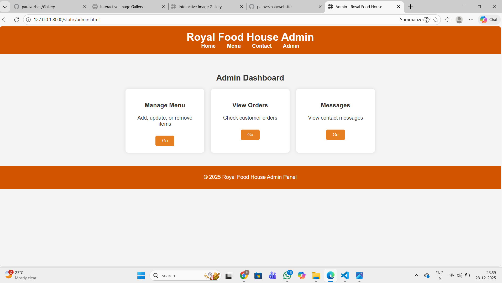

# Ex.07 Restaurant Website
# Date: 05.12.2025
# AIM:
To develop a static Restaurant website to display the food items and services provided by them.

# DESIGN STEPS:
## Step 1:
Requirement collection.

## Step 2:
Creating the layout using HTML and CSS.

## Step 3:
Updating the sample content.

## Step 4:
Choose the appropriate style and color scheme.

## Step 5:
Validate the layout in various browsers.

## Step 6:
Validate the HTML code.

## Step 7:
Publish the website in the given URL.

# PROGRAM:
```
index.html 

<!DOCTYPE html>
<html lang="en">
<head>
    <meta charset="UTF-8">
    <title>Food Palace - Home</title>
    <link rel="stylesheet" href="style.css">
</head>
<body>

    <header>
        <h1>ROYAL FOOD HOUSE</h1>
        <nav>
            <a href="index.html">Home</a>
            <a href="menu.html">Menu</a>
            <a href="contact.html">Contact</a>
            <a href="admin.html">Admin</a>
        </nav>
    </header>

    <section class="hero">
        
        <h2>Welcome to royal food house</h2>
        <p>Delicious Food • Great Taste • Best Prices</p>
        <a href="menu.html" class="btn">View Menu</a>
    </section>

    <section>
        <h2>Why Choose Us?</h2>
        <div class="menu-box">
            <div class="menu-item">
                <h3>Fresh Food</h3>
                <p>Only fresh and quality ingredients</p>
            </div>
            <div class="menu-item">
                <h3>Fast Service</h3>
                <p>Quick service and friendly staff</p>
            </div>
            <div class="menu-item">
                <h3>Affordable</h3>
                <p>Best prices for great taste</p>
            </div>
        </div>
    </section>

    <section>
        <h2>About royal food house</h2>
        <p>
            Food Palace is a place where taste meets quality.
            We serve delicious meals prepared with love and care.
        </p>
        <a href="contact.html" class="btn">Contact Us</a>
    </section>

    <footer>
        <p>© 2025 Royal Food House. All rights reserved.</p>
    </footer>

</body>
</html>

menu.html

<!DOCTYPE html>
<html lang="en">
<head>
    <meta charset="UTF-8">
    <title>Menu - Food Palace</title>
    <link rel="stylesheet" href="style.css">
</head>
<body>

<header>
    <h1>Food Palace</h1>
    <nav>
        <a href="index.html">Home</a>
        <a href="menu.html">Menu</a>
        <a href="contact.html">Contact</a>
        <a href="admin.html">Admin</a>
    </nav>
</header>

<section>
    <h2>Our Menu</h2>
    <div class="menu-box">
        <div class="menu-item">
            
            <h3>Pizza</h3>
            <p>Cheesy and delicious</p>
            <p><strong>200rs</strong></p>
        </div>
        <div class="menu-item">
            
            <h3>Burger</h3>
            <p>Juicy grilled burger</p>
            <p><strong>150rs</strong></p>
        </div>
        <div class="menu-item">
            
            <h3>Pasta</h3>
            <p>Italian style pasta</p>
            <p><strong>180rs</strong></p>
        </div>
        <div class="menu-item">
            
            <h3>Sandwich</h3>
            <p>Fresh and healthy</p>
            <p><strong>120rs</strong></p>
        </div>
        <div class="menu-item">
            
            <h3>French Fries</h3>
            <p>Crispy & golden</p>
            <p><strong>100rs</strong></p>
        </div>
        <div class="menu-item">
            
            <h3>Cold Drink</h3>
            <p>Refreshing beverage</p>
            <p><strong>80rs</strong></p>
        </div>
    </div>
</section>

<footer>
    <p>© 2025 Food Palace. All rights reserved.</p>
</footer>

</body>
</html>

contact.html

<!DOCTYPE html>
<html lang="en">
<head>
    <meta charset="UTF-8">
    <title>Contact - Royal Food House</title>
    <link rel="stylesheet" href="style.css">
</head>
<body>

<header>
    <h1>Royal Food House</h1>
    <nav>
        <a href="index.html">Home</a>
        <a href="menu.html">Menu</a>
        <a href="contact.html">Contact</a>
        <a href="admin.html">Admin</a>
    </nav>
</header>

<section>
    <h2>Contact Us</h2>
    <div class="contact-box">
        <p><strong>Email:</strong> royalfoodhouse@email.com</p>
        <p><strong>Phone:</strong> +91 123 456 7890</p>
        <p><strong>Address:</strong> 123 Food Street, City</p>
    </div>
</section>

<footer>
    <p>© 2025 Royal Food House. All rights reserved.</p>
</footer>

</body>
</html>

admin.html

<!DOCTYPE html>
<html lang="en">
<head>
    <meta charset="UTF-8">
    <title>Admin - Royal Food House</title>
    <link rel="stylesheet" href="style.css">
</head>
<body>

<header>
    <h1>Royal Food House Admin</h1>
    <nav>
        <a href="index.html">Home</a>
        <a href="menu.html">Menu</a>
        <a href="contact.html">Contact</a>
        <a href="admin.html">Admin</a>
    </nav>
</header>

<section>
    <h2>Admin Dashboard</h2>
    <div class="admin-box">
        <div class="admin-card">
            <h3>Manage Menu</h3>
            <p>Add, update, or remove items</p>
            <button>Go</button>
        </div>
        <div class="admin-card">
            <h3>View Orders</h3>
            <p>Check customer orders</p>
            <button>Go</button>
        </div>
        <div class="admin-card">
            <h3>Messages</h3>
            <p>View contact messages</p>
            <button>Go</button>
        </div>
    </div>
</section>

<footer>
    <p>© 2025 Royal Food House Admin Panel</p>
</footer>

</body>
</html>

```
# OUTPUT:






# RESULT:
The program for designing software company website using HTML and CSS is completed successfully.
